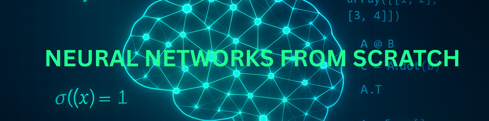

# 🧠 Neural Networks from Scratch – Math-Based Projects

- Welcome to this curated collection of 10 foundational Artificial Neural Network (ANN) projects — built completely <br>
from scratch, with a focus on mathematical understanding over library abstraction.
- This repository is perfect for students, educators, and self-learners who want to truly grasp the internals <br>
of how ANNs work from perceptrons to time series forecasting.


[](https://www.python.org/)  
[](https://jupyter.org/)  
[](LICENSE)  
[](#-contributing)  


## 📦 Project Structure

| #  | Folder                             | Project                         | Key Concepts                         |
| -- | ---------------------------------- | ------------------------------- | ------------------------------------ |
| 01 | [01_perceptron_learning](01_nn_from_scratch)          | Perceptron Learning Rule        | Linear separability, weight updates  |
| 02 | [02_xor_mlp](02_xor_classification)                      | XOR with MLP                    | Non-linearity, backpropagation       |
| 03 | [03_mnist_digit_recognition](03_mnist_digit_recognition)     | MNIST Digit Recognition         | Multi-class classification, softmax  |
| 04 | [04_nn_visualizer](04_nn_visualizer)                | Neural Network Visualizer       | Training dynamics, weight evolution  |
| 05 | [05_custom_dataset_ann](05_custom_dataset_ann)          | Custom Dataset ANN              | Tabular data, label encoding         |
| 06 | [06_loss_landscape](06_loss_landscape)              | Loss Surface Visualization      | Loss contours, optimization geometry |
| 07 | [07_backprop_simulator](07_backprop_simulator)           | Backpropagation Simulator       | Chain rule, matrix calculus          |
| 08 | [08_activation_function_analysis](08_activation_function_analysis) | Activation Function Comparison  | ReLU vs. Sigmoid vs. Tanh            |
| 09 | [09_dropout_regularization](09_dropout_regularization)       | Dropout Regularization (Manual) | Overfitting prevention               |
| 10 | [10_time_series_ann](10_time_series_ann)              | Time Series Forecasting         | Sliding window, ANN regression       |

## 📚 Skills You’ll Build

✅ Manual backpropagation

✅ Chain rule and gradient computation

✅ Custom ANN architecture design

✅ Loss landscape interpretation

✅ Time series input windowing

✅ Dropout from scratch

✅ Visualizing model behavior

## 🚀 Getting Started
```
git clone https://github.com/arun-techverse/neural-networks-from-scratch-math-projects.git
cd neural-networks-from-scratch-math-projects
```

## 🛠 Tech Stack

- Python (NumPy, Matplotlib, scikit-learn, TensorFlow)

- No frameworks for core math logic (except when comparison required)

- Clean, beginner-friendly code

## 📌 Recommended Prerequisites

- Basic linear algebra and calculus

- Python programming (NumPy basics)

## Activation Function

An **activation function** in a neural network determines whether a neuron should be activated or not. It introduces **non-linearity** into the model, which is crucial for neural networks to learn complex patterns and relationships in data. Without activation functions, a neural network would essentially behave like a linear regression model, regardless of how many layers it has, limiting its ability to model non-linear data.

***

## Purpose of Activation Functions

The primary purposes of activation functions are:

* **Introducing Non-Linearity**: Real-world data is often non-linear. Without non-linear activation functions, a neural network would only be able to learn and represent linear relationships between inputs and outputs. This significantly restricts its ability to solve complex problems. Activation functions transform the weighted sum of inputs into an output that is then passed to the next layer, enabling the network to learn intricate, non-linear mappings.
* **Enabling Backpropagation**: Most activation functions are differentiable, which is a key requirement for the **backpropagation algorithm**. Backpropagation is the process by which neural networks learn by adjusting their weights based on the error of their predictions. The derivative of the activation function is used to calculate the gradients during this process, allowing for efficient optimization of the network's parameters.
* **Output Transformation**: Activation functions can also constrain the output of a neuron to a specific range, which is useful for certain types of problems (e.g., probabilities between 0 and 1 for classification).

***

## Common Types of Activation Functions

Here are some of the most common activation functions:

### 1. Sigmoid Function (Logistic)
The Sigmoid function, also known as the logistic function, is an S-shaped curve that squashes input values between 0 and 1.


* **Formula**: $f(x) = \frac{1}{1 + e^{-x}}$
* **Range**: (0, 1)
* **Use Cases**: Historically used in hidden layers, it's now primarily used in the **output layer for binary classification problems**, where the output needs to be interpreted as a probability.
* **Pros**:
    * Outputs are normalized between 0 and 1, useful for probability predictions.
    * Smooth, continuous, and differentiable at all points.
* **Cons**:
    * **Vanishing Gradient Problem**: For very large positive or negative inputs, the gradient of the sigmoid function becomes very small (saturates), leading to slow or halted learning in deep networks.
    * Outputs are not zero-centered, which can make optimization more difficult.

***

### 2. Tanh Function (Hyperbolic Tangent)
The Tanh function is also S-shaped, similar to sigmoid, but it squashes input values between -1 and 1.


* **Formula**: $f(x) = \frac{e^x - e^{-x}}{e^x + e^{-x}}$
* **Range**: (-1, 1)
* **Use Cases**: Often preferred over sigmoid for **hidden layers** due to its zero-centered output. Useful in tasks like speech recognition and natural language processing.
* **Pros**:
    * Outputs are zero-centered, which generally makes training more stable and efficient.
    * It has a steeper gradient than sigmoid, potentially leading to faster convergence than sigmoid for some parts of the input range.
* **Cons**:
    * Still suffers from the **vanishing gradient problem** for very large or very small inputs, similar to the sigmoid function.

***

### 3. ReLU Function (Rectified Linear Unit)
ReLU is one of the most widely used activation functions in deep learning. It outputs the input directly if it is positive, and 0 otherwise.


* **Formula**: $f(x) = \max(0, x)$
* **Range**: [0, $\infty$)
* **Use Cases**: Widely used in **hidden layers** of deep neural networks, especially in convolutional neural networks.
* **Pros**:
    * **Mitigates Vanishing Gradient Problem**: For positive inputs, the gradient is always 1, which helps prevent gradients from vanishing.
    * **Computational Efficiency**: Simple mathematical operation makes it very fast to compute.
    * Introduces sparsity by outputting 0 for negative inputs, potentially leading to more efficient representations.
* **Cons**:
    * **Dying ReLU Problem**: Neurons can become "dead" (output 0 for all inputs) if their weights are updated in such a way that they only receive negative inputs. Once a neuron outputs 0, its gradient is 0, and it stops learning.
    * Not zero-centered.

***

### 4. Softmax Function
The Softmax function is typically used in the output layer of neural networks for **multi-class classification problems**. It transforms a vector of raw scores (logits) into a probability distribution, where the sum of all probabilities is 1.


* **Formula**: For a vector of inputs $z = (z_1, z_2, ..., z_K)$, the softmax function calculates the probability for each class $i$ as:
    $P(y=i | z) = \frac{e^{z_i}}{\sum_{j=1}^{K} e^{z_j}}$
* **Range**: (0, 1) for each output, and the sum of all outputs is 1.
* **Use Cases**: Exclusively used in the **output layer for multi-class classification** tasks (e.g., image classification where an image belongs to one of several categories).
* **Pros**:
    * Provides a probability distribution over multiple classes, making outputs easily interpretable.
    * Enhances the largest input values, making the highest probability class more distinct.
* **Cons**:
    * Can suffer from numerical stability issues with very large input values due to the exponentiation.

***

## Other Notable Activation Functions

* **Leaky ReLU**: An attempt to address the "dying ReLU" problem by allowing a small, non-zero gradient for negative inputs. Formula: $f(x) = \max(\alpha x, x)$, where $\alpha$ is a small positive constant (e.g., 0.01).
* **Parametric ReLU (PReLU)**: Similar to Leaky ReLU, but $\alpha$ is a learnable parameter.
* **Exponential Linear Units (ELU)**: Aims to make the mean activation closer to zero, which can speed up learning. It also avoids the "dying ReLU" problem.
* **Swish**: A self-gated activation function that has shown to outperform ReLU in deeper models. Formula: $f(x) = x \cdot \text{sigmoid}(x)$.

The choice of activation function depends on the specific problem, network architecture, and desired output characteristics. While ReLU and its variants are often the go-to choices for hidden layers due to their efficiency and ability to mitigate vanishing gradients, sigmoid and softmax remain crucial for output layers in classification tasks.
